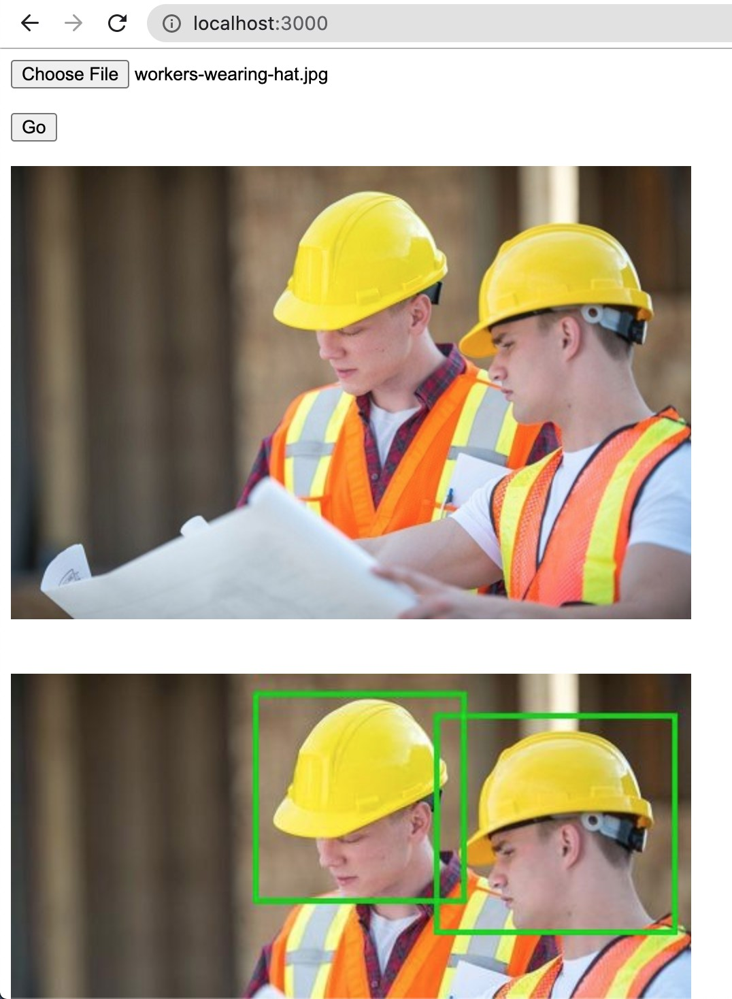

## What does it do?

1. Upload image files to S3 bucket, under the *inbound* folder.
2. Monitor the *rendered-inbound* folder on S3, wait for the output file.
3. Download the output file to *rendered-images* folder and show it on the page.

## How to start it?

1. Clone the repository.
2. run `yarn install`
3. run `AWS_ACCESS_KEY_ID=<your access key id> AWS_SECRET_ACCESS_KEY=<your secret access key> BUCKET=<your bucket name> node server.js`
4. Access `http://localhost:3000`.

